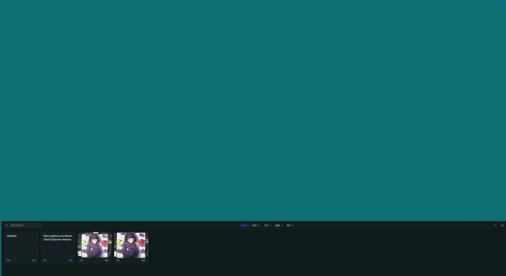
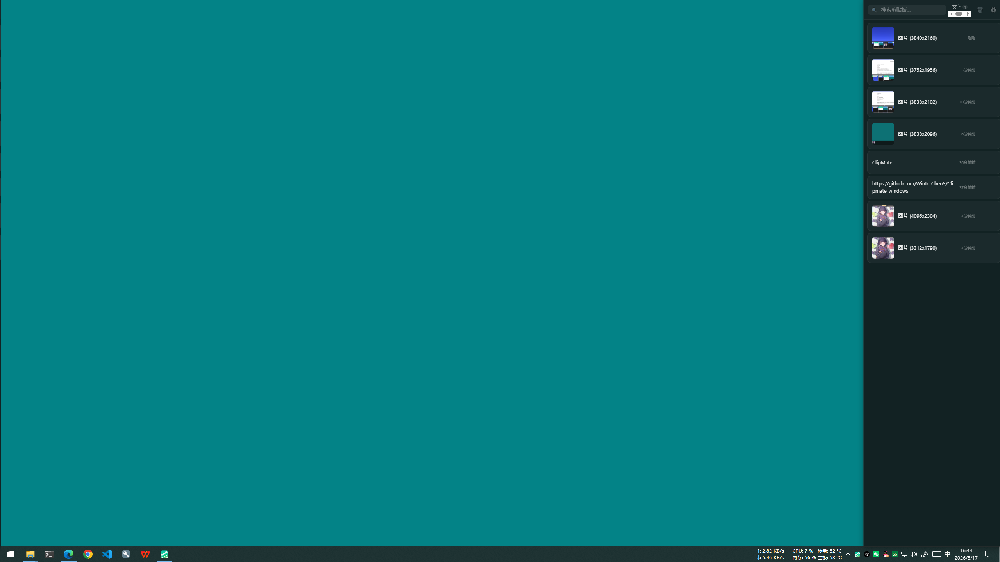

# ClipMate

<p align="center">
  <strong>A Lightweight Clipboard Manager for Windows — Inspired by macOS Paste</strong>
</p>

<p align="center">
  
  
  
  
  
</p>

<p align="center">
  <a href="../README.md">简体中文</a> | <a href="README.en.md">English</a> | <a href="README.ja.md">日本語</a> | <a href="README.ko.md">한국어</a>
</p>

## Preview

<p align="center">
  
  
</p>

## Features

- **Global Hotkey** — Summon the panel anytime with `Ctrl + Shift + V`
- **Dual Layout** — Bottom bar (macOS Paste style) or right-side sidebar, freely switchable
- **Multi-type Support** — Text, images, and links, auto-categorized
- **Smart Search** — Real-time filtering of clipboard history
- **Pin Favorites** — Pin important items to the top so they won't be overwritten
- **Image File Storage** — PNG files instead of base64, ~99% less memory usage
- **Image Dedup** — MD5 fingerprint comparison to avoid storing duplicates
- **Auto Cleanup** — 7-day expiration + 200MB storage cap + orphan file recycling
- **Persistent History** — JSON file storage + separate image files, survives restarts (up to 200 items)
- **Glassmorphism UI** — Semi-transparent blurred background with a modern feel
- **System Tray** — Minimizes to tray and runs in the background
- **Auto Start** — Optional launch at startup (controlled via tray menu)
- **Single Instance** — Prevents multiple windows from opening
- **Keyboard Navigation** — Arrow keys to switch, Enter to paste, Esc to close
- **Custom Hotkey** — Record your own global shortcut
- **NSIS/MSI Installer** — Standard Windows installers

## Keyboard Shortcuts

| Shortcut | Action |
|----------|--------|
| `Ctrl + Shift + V` | Show / Hide panel (customizable) |
| `Ctrl + ,` | Open settings panel |
| `Double-click` | Paste selected item |
| `Enter` | Paste current selection |
| `Esc` | Close panel |
| `←` `→` / `↑` `↓` | Navigate items (direction adapts to layout) |

## Project Structure

```
clipboard-manager/
├── src/                    # Frontend source (vanilla JS)
│   ├── main.js             # Main app logic (search, dual layout, settings, keyboard nav)
│   └── styles.css          # Global styles (glassmorphism + dual mode + light/dark themes)
├── src-tauri/              # Rust backend
│   ├── src/
│   │   ├── main.rs         # Window management, tray, clipboard watcher, hotkeys, cleanup
│   │   ├── commands.rs     # Tauri commands (CRUD, paste, settings, autostart)
│   │   └── models.rs       # Data models, persistence, image storage, MD5 dedup, cleanup
│   ├── icons/              # App icon assets
│   ├── capabilities/       # Tauri permission config
│   ├── Cargo.toml          # Rust dependencies
│   └── tauri.conf.json     # Tauri config
├── index.html              # HTML entry point
├── package.json            # Frontend dependencies
├── vite.config.js          # Vite config
└── build.bat               # Windows one-click build script
```

## Tech Stack

| Tech | Purpose | Version |
|------|---------|---------|
| [Tauri](https://tauri.app/) | Desktop app framework | 2.x |
| [Rust](https://www.rust-lang.org/) | Backend core | 1.95+ |
| [Vite](https://vitejs.dev/) | Frontend build tool | 6.x |
| [Vanilla JS](https://developer.mozilla.org/en-US/docs/Web/JavaScript) | UI rendering | ES6+ |

### Rust Core Dependencies

| Dependency | Purpose |
|------------|---------|
| `arboard` | Clipboard read/write |
| `tauri-plugin-global-shortcut` | Global hotkeys |
| `tauri-plugin-autostart` | Auto-start on boot |
| `tauri-plugin-single-instance` | Single instance lock |
| `tauri-plugin-opener` | Open external links |
| `reqwest` | HTTP requests (version check) |
| `windows` | Win32 API (SendInput for simulated paste) |

## Getting Started

### Prerequisites

- Node.js >= 18
- Rust >= 1.70 (install via `rustup`)
- Windows 10/11

### Install Dependencies

```bash
cd clipboard-manager
npm install
```

### Development

```bash
# Start Tauri dev server (frontend hot-reload + Rust auto-recompile)
npx tauri dev
```

### Build

```bash
# One-click build (frontend + Rust compile + package installers)
build.bat

# Or build manually
npx tauri build
```

Build artifacts are located in `src-tauri/target/release/bundle/`:
- `nsis/ClipMate_1.2.2_x64-setup.exe` — NSIS installer
- `msi/ClipMate_1.2.2_x64_en-US.msi` — MSI installer
- `../clipmate.exe` — Standalone executable

## Data Storage

All data is stored under `%APPDATA%/clipmate/`:

| File / Directory | Description |
|------------------|-------------|
| `clipboard-history.json` | Clipboard history + pinned items |
| `settings.json` | User settings (layout mode, max items, hotkey, etc.) |
| `images/{id}.png` | Image file storage (PNG format) |
| `debug.log` | Runtime log (auto-rotated, 512KB max) |

## License

[MIT](../LICENSE)
